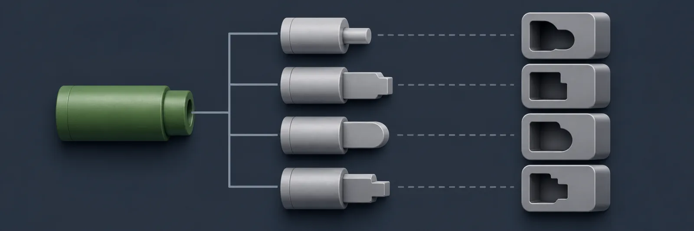
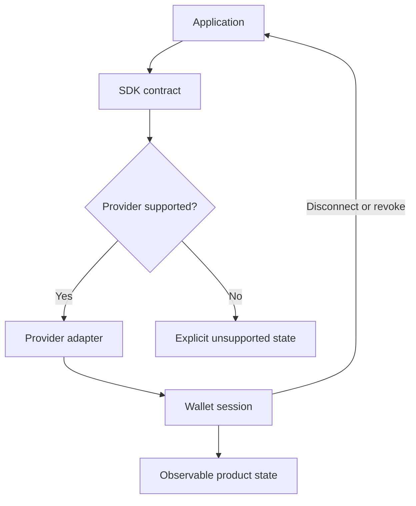

[← All systems](https://github.com/J0UH) · [Open finance and payments](https://github.com/J0UH/open-finance-payments)

  

# Wallet and integration SDK

Wallet integrations sit at an awkward boundary. Product teams want one clean interface, but the underlying providers, networks, permissions, sessions, and error modes refuse to behave uniformly. This work turned that variation into a smaller contract that applications could rely on.

## The engineering problem

An SDK has to hide accidental complexity without hiding the states developers must handle. Compatibility, clear errors, predictable lifecycle events, and safe defaults matter more than a clever abstraction.

## Foundation and adaptation

Part of this work adapts [Reown AppKit](https://github.com/reown-com/appkit), retained under its Apache-2.0 licence. The adapter work covers the smaller SDK contract, provider integration, product lifecycle, and operating behaviour built around that foundation.

## What the system covers

- Provider and connector abstraction
- Session and network lifecycle handling
- Typed integration surfaces
- Error normalisation and recovery
- Application examples and developer guidance

## System shape

## Build notes

- Keep provider-specific behaviour at the edge.
- Make lifecycle changes observable instead of surprising the application.
- Prefer a small stable contract over a wrapper for every upstream option.

Public overview only. Source code, customer data, credentials, and private operating details are not included.

## Talk through a similar problem

Working on something similar? [Tell me about it](mailto:ju@jomena.group?subject=Wallet%20and%20integration%20SDK).
