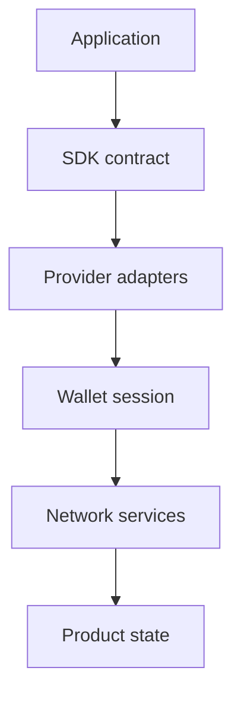

  

# Wallet and integration SDK

Wallet integrations sit at an awkward boundary. Product teams want one clean interface, but the underlying providers, networks, permissions, sessions, and error modes refuse to behave uniformly. This work turned that variation into a smaller contract that applications could rely on.

[Discuss a similar system](mailto:ju@jomena.group?subject=Discuss%20Wallet%20and%20integration%20SDK) | [Book a technical call](mailto:ju@jomena.group?subject=Book%20a%20technical%20call%20about%20Wallet%20and%20integration%20SDK)

## The engineering problem

An SDK has to hide accidental complexity without hiding the states developers must handle. Compatibility, clear errors, predictable lifecycle events, and safe defaults matter more than a clever abstraction.

## What the system covers

- Provider and connector abstraction
- Session and network lifecycle handling
- Typed integration surfaces
- Error normalisation and recovery
- Application examples and developer guidance

## System shape

## Build notes

- Keep provider-specific behaviour at the edge.
- Make lifecycle changes observable instead of surprising the application.
- Prefer a small stable contract over a wrapper for every upstream option.

Built under the Aryze umbrella. The underlying source and company IP remain private and owned by Aryze. Delivery involved people across engineering, product, operations, compliance, and design. Open-source foundations retain their original attribution and licences.

## Talk through a similar problem

If you are trying to build, untangle, or ship a system in this area, [send me a note](mailto:ju@jomena.group?subject=I%20need%20help%20with%20Wallet%20and%20integration%20SDK). If the problem needs a deeper technical conversation, [book a call by email](mailto:ju@jomena.group?subject=Book%20a%20technical%20call%20about%20Wallet%20and%20integration%20SDK).
