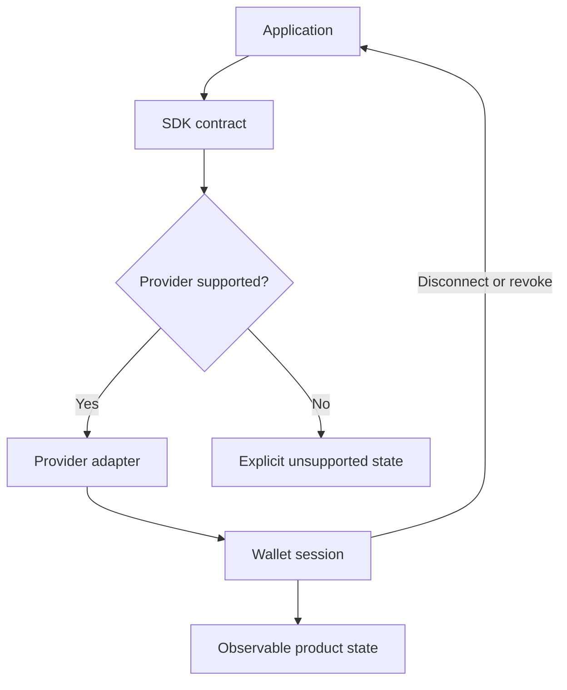

[← All work](https://github.com/J0UH) · [Open finance and payments](https://github.com/J0UH/open-finance-payments)

# Wallet and integration SDK

A smaller application interface around providers and networks that behave differently underneath.

Product teams want a wallet connection that fits their application. The providers bring different sessions, network lifecycles, permissions, and error states.

This work turns that variation into a more manageable integration contract. Part of it adapts Reown AppKit, with the local work in provider integration, lifecycle handling, and the behaviour exposed to products.

## Hiding the right amount

An application still needs to know when its session changes, when a network is unsuitable, or when an operation needs recovery. Those states cannot disappear just because the wrapper is convenient.

I keep provider-specific behaviour at the edge and make lifecycle changes observable. Typed interfaces and normalised errors help the consuming product handle the states that matter.

The aim is a small, stable contract rather than a wrapper for every upstream option. Application examples and developer guidance complete that work by showing how the integration behaves outside the ideal path.

## Built on

Part of this work adapts [Reown AppKit](https://github.com/reown-com/appkit), retained under its Apache-2.0 licence. The adapter work covers the smaller SDK contract, provider integration, product lifecycle, and operating behaviour built around that foundation.

## What the work covers

- Provider and connector abstraction
- Session and network lifecycle handling
- Typed integration surfaces
- Error normalisation and recovery
- Application examples and developer guidance

A closer look at the technical flow

## Related work

- [Open finance and payments](https://github.com/J0UH/open-finance-payments)
- [Decentralised exchange platform](https://github.com/J0UH/dex-platform)
- [Multi-asset money platform](https://github.com/J0UH/multi-asset-money-platform)

Working on a similar problem? [Tell me what you are building](mailto:ju@jomena.group?subject=Wallet%20and%20integration%20SDK).

*This is a public account of the work. Source code and private operating details are not included in this repository.*
